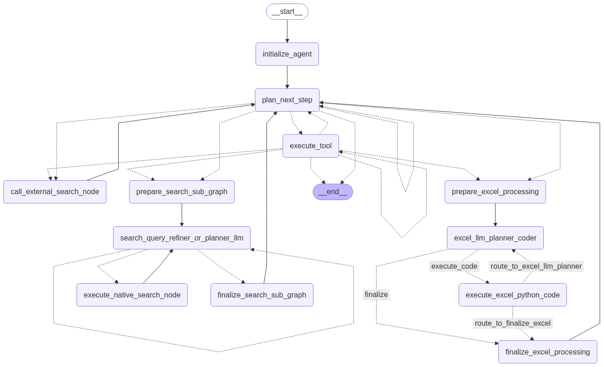

# My First GAIA Benchmark Agent with LangGraph

Welcome to my first attempt at creating an agent for the GAIA (General AI Assistants) benchmark! This project is a learning exercise, primarily focused on exploring the capabilities of LangGraph for building complex, tool-using AI agents.

The agent is designed to tackle a subset of GAIA Level 1 questions, leveraging various tools and sub-graphs for specialized tasks. While the primary goal was to make it functional, I'm aware there's significant room for improvement and further development.

**Disclaimer:** This is a work in progress and my initial foray into building sophisticated AI agents.

## Core Idea

This agent uses the [LangGraph](https://github.com/langchain-ai/langgraph) framework to orchestrate calls to Large Language Models (LLMs) – specifically Google's Gemini models – and a suite of custom-built tools. It features dedicated sub-graphs for tasks like Excel processing and web searching to manage complexity.

## Current Capabilities

Based on the design, the agent aims to handle:

* **File Downloading:** Fetching files associated with tasks via an API.
* **Python Code Execution:** Running Python code snippets and scripts, including diagnostic information for debugging. (Security considerations for this tool are noted in the "Future Improvements" section).
* **Multimodal Input Processing:** Handling prompts related to image, audio, or video files by passing them to a capable LLM.
* **Chess Analysis:**
    * Generating FEN (Forsyth-Edwards Notation) from chess diagram images using an external script.
    * Analyzing FEN positions using the Stockfish chess engine to find the best move.
    * Modifying FEN strings (e.g., active player).
* **YouTube Video Analysis:** Directly processing YouTube video URLs to answer questions about their content.
* **Excel Data Processing:** A dedicated sub-graph iteratively generates and executes pandas code via the `PythonInterpreterTool` to inspect, clean, and perform calculations on Excel files.
* **Web Searching:** A dedicated sub-graph manages web search queries, including query refinement and result analysis, using an external script for Google Search.

## Tech Stack

* **LangGraph & LangChain:** For agent orchestration and state management.
* **Google Gemini:** As the core Large Language Model.
* **Python:** The primary programming language.
* Various Python libraries for tools (see `requirements.txt`).

## Agent Architecture (LangGraph)

The agent's core logic is implemented as a state graph using LangGraph. This allows for complex, cyclical, and conditional flows of execution. Below is a visual representation of the main graph structure:

 

**Key Components and Flow:**

* **`__start__` -> `initialize_agent`**: The graph starts by initializing the agent's state, including the original question and task ID.
* **`plan_next_step`**: This is the main planning node where the LLM is invoked. Based on the current question, intermediate steps, and available tools, the LLM decides:
    * To call a specific tool.
    * To initiate a specialized sub-graph (for searching or Excel processing).
    * To provide a direct answer.
    * This node uses a comprehensive system prompt to guide the LLM.
* **`execute_tool`**: If the planner decides to use a standard tool (e.g., `FileDownloaderTool`, `PythonInterpreterTool`, `YouTubeVideoAnalysisTool`, `MultimodalProcessingTool`, `ChessAnalysisTool`), this node executes it and adds the result to the `intermediate_steps` in the agent's state.
* **Conditional Routing (Dotted Lines)**: After `plan_next_step` or `execute_tool`, a router function (`should_continue_or_finish` in the code) determines the next step:
    * Proceed to `execute_tool` if a tool was selected.
    * Enter one ofthe sub-graphs.
    * Loop back to `plan_next_step` for replanning if more steps are needed or an error occurred.
    * Transition to `__end__` if a final answer is available or a critical error/max iterations are reached.
* **Search Sub-Graph:**
    * Triggered by the `INITIATE_SEARCH_SUB_GRAPH` action from `plan_next_step`.
    * **`prepare_search_sub_graph`**: Initializes the state for the search sub-process.
    * **`search_query_refiner_or_planner_llm`**: An LLM call dedicated to refining the search query or deciding if the current search results are sufficient. It can loop back to execute another search or finalize.
    * **`execute_native_search_node`**: Executes the actual web search (in your case, via the `external_Google Search_EXACT.py` script).
    * **`finalize_search_sub_graph`**: Processes the search results and prepares a summary to be added to the main agent's `intermediate_steps` before returning to `plan_next_step`.
* **Excel Sub-Graph:**
    * Triggered by the `REQUEST_EXCEL_PROCESSING` action from `plan_next_step`.
    * **`prepare_excel_processing`**: Initializes the state for Excel processing.
    * **`excel_llm_planner_coder`**: A dedicated LLM call to generate Python (pandas) code for inspecting or querying the Excel file. This LLM only has access to the `PythonInterpreterTool`.
    * **`execute_excel_python_code`**: Runs the generated pandas code using the `PythonInterpreterTool`.
    * The Excel sub-graph can iterate, allowing the `excel_llm_planner_coder` to refine the pandas code based on previous execution results or errors.
    * **`finalize_excel_processing`**: Takes the result from the pandas code execution and adds it to the main agent's `intermediate_steps`, then returns to `plan_next_step`.
* **`call_external_search_node`**: The graph also shows a direct path for this node. You might want to clarify in the text if this is an alternative or older path compared to the search sub-graph, or if it serves a different specific search purpose. [cite: 37, 38]
* **`__end__`**: Represents the termination of the agent's process for a given question, usually when a `final_answer` is populated in the state.

The agent state (`AgentState`) is passed between nodes, with each node potentially modifying it. The use of `intermediate_steps` and specific history arrays within sub-graphs (like `excel_code_execution_history`) allows the LLM to maintain context and learn from previous attempts within a task.

## External Components & Credits

* **Chess FEN Generator:** The chess image-to-FEN capability relies on an external Python script. The FEN generation from chess diagrams is based on by the work found at https://github.com/tsoj/Chess_diagram_to_FEN.
* **Stockfish:** For chess analysis.

## How to Run (High-Level)

1.  **Clone the repository.**
2.  **Set up a Python environment** (e.g., using `venv` or `conda`).
3.  **Install dependencies:** `pip install -r requirements.txt`
4.  **Set up API Keys:** Ensure you have your `GOOGLE_API_KEY` set as an environment variable. For local development, you can use a `.env` file (ensure `.env` is in your `.gitignore`!).
5.  **External Dependencies:**
    * **Stockfish:** Make sure Stockfish is installed and the path to its executable is correctly configured in the `ChessAnalysisTool` (ideally via an environment variable like `STOCKFISH_PATH`).
    * **FEN Generator Script & Environment:** The `ExternalFenGeneratorTool` calls an external Python script (`run_fen_generator.py`) using a specific Python interpreter (`PICTOCODE_PYTHON_PATH`). Ensure this script and its environment are set up. Paths should ideally be configurable via environment variables.
    * **Google Search Script:** The `external_Google Search_EXACT.py` script is used by the search sub-graph.
6.  **Run the main agent script** (e.g., `python my_langgraph_agent.py`, assuming your main file from `appv3.py` is named this).

## Future Improvements & Considerations

This project has many areas for potential enhancement, including (inspired by a detailed code review):

* **Enhanced Security for `PythonInterpreterTool`:** Implementing proper sandboxing (e.g., Docker) for executing LLM-generated code is crucial for any production-like environment.
* **Configuration Management:** Moving all hardcoded paths (Stockfish, FEN generator scripts, Python interpreters for external scripts) to environment variables or a central configuration file.
* **Improved Logging:** Transitioning from `print()` statements to the `logging` module for better control and structured logging.
* **Prompt Optimization:** Refining and possibly shortening the complex system prompts to improve LLM performance and reduce token usage.
* **Robust Error Handling:** Implementing more specific exception handling in tools and graph nodes.
* **Testing:** Adding unit tests for tools and integration tests for agent flows.
* **Code Modularity:** Potentially breaking down the very long `my_langgraph_agent.py` into smaller, more manageable modules.
* **Search Mechanism:** Consolidating search logic, potentially replacing the external search script with a direct SDK integration if feasible.

## Support My Work

If you find this project interesting or it helps you in your learning journey, I'd be grateful for your support!

https://buymeacoffee.com/csokosgeza

---
